# nuvia_v2_dev

## Table Of Contents

1. 1755328001959 Entities
   1. log_usage_subscription(LogUsageSubscription)
   2. permission_grant(PermissionGrant)
   3. permission(Permission)
   4. organization_role(OrganizationRole)
   5. answer(Answer)
   6. question_option(QuestionOption)
   7. question_answer(QuestionAnswer)
   8. question(Question)
   9. category(Category)
   10. survey(Survey)
   11. subscription(Subscription)
   12. plan_discount(PlanDiscount)
   13. plan_grant(PlanGrant)
   14. plan(Plan)
   15. payment(Payment)
   16. user_secret(UserSecret)
   17. profile(Profile)
   18. user_access(UserAccess)
   19. user(User)
2. ER Diagram

## 1755328001959 Entities

### log_usage_subscription(LogUsageSubscription)

#### log_usage_subscription(LogUsageSubscription) columns

| Database Name | Property Name | Attribute | Type          | Nullable | Charset | Comment     |
| ------------- | ------------- | --------- | ------------- | -------- | ------- | ----------- |
| created_at    | createdAt     |           | \*datetime    |          |         | 생성 일시   |
| updated_at    | updatedAt     |           | \*datetime    |          |         | 수정 일시   |
| deleted_at    | deletedAt     |           | datetime      | Nullable |         | 삭제 일시   |
| id            | id            | PK        | \*number      |          |         |             |
| user_id       | userId        | FK        | \*number      |          |         | 사용자 ID   |
| plan_id       | planId        | FK        | \*number      |          |         | 플랜 ID     |
| target        | target        |           | \*varchar(45) |          |         | 대상        |
| status        | status        |           | \*varchar(45) |          |         | 상태        |
| usage         | usage         |           | \*int         |          |         | 사용량      |
| remain        | remain        |           | \*int         |          |         | 남은 사용량 |
| total         | total         |           | \*int         |          |         | 총 사용량   |

#### log_usage_subscription(LogUsageSubscription) indices

| Database Name                              | Property Name                              | Unique | Columns |
| ------------------------------------------ | ------------------------------------------ | ------ | ------- |
| idx_log_usage_subscription_user_id_plan_id | idx_log_usage_subscription_user_id_plan_id |        |         |
| idx_log_usage_subscription_target          | idx_log_usage_subscription_target          |        |         |
| idx_log_usage_subscription_status          | idx_log_usage_subscription_status          |        |         |
| idx_log_usage_subscription_plan_id         | idx_log_usage_subscription_plan_id         |        |         |
| idx_log_usage_subscription_user_id         | idx_log_usage_subscription_user_id         |        |         |

### permission_grant(PermissionGrant)

#### permission_grant(PermissionGrant) columns

| Database Name | Property Name | Attribute | Type          | Nullable | Charset | Comment          |
| ------------- | ------------- | --------- | ------------- | -------- | ------- | ---------------- |
| created_at    | createdAt     |           | \*datetime    |          |         | 생성 일시        |
| updated_at    | updatedAt     |           | \*datetime    |          |         | 수정 일시        |
| deleted_at    | deletedAt     |           | datetime      | Nullable |         | 삭제 일시        |
| id            | id            | PK        | \*number      |          |         | 권한 관리 아이디 |
| permission_id | permissionId  | FK        | \*number      |          |         | 권한 아이디      |
| type          | type          |           | \*varchar(45) |          |         | 권한 타입        |
| description   | description   |           | varchar(200)  | Nullable |         | 권한 설명        |
| is_allowed    | isAllowed     |           | \*tinyint     |          |         | 권한 허용 여부   |

### permission(Permission)

#### permission(Permission) columns

| Database Name | Property Name | Attribute | Type          | Nullable | Charset | Comment          |
| ------------- | ------------- | --------- | ------------- | -------- | ------- | ---------------- |
| created_at    | createdAt     |           | \*datetime    |          |         | 생성 일시        |
| updated_at    | updatedAt     |           | \*datetime    |          |         | 수정 일시        |
| deleted_at    | deletedAt     |           | datetime      | Nullable |         | 삭제 일시        |
| id            | id            | PK        | \*number      |          |         |                  |
| role          | role          | UK        | \*varchar(45) |          |         | 권한 이름        |
| description   | description   |           | varchar(200)  | Nullable |         | 권한 설명        |
| sequence      | sequence      |           | \*int         |          |         | 권한 순서        |
| is_deprecated | isDeprecated  |           | \*tinyint     |          |         | 권한 비활성 여부 |
| is_default    | isDefault     |           | \*tinyint     |          |         | 권한 기본 여부   |

#### permission(Permission) indices

| Database Name                  | Property Name                  | Unique | Columns |
| ------------------------------ | ------------------------------ | ------ | ------- |
| index_permission_sequence      | index_permission_sequence      |        |         |
| IDX_ed11e3b03e1d831a38ccace186 | IDX_ed11e3b03e1d831a38ccace186 | Unique |         |

### organization_role(OrganizationRole)

#### organization_role(OrganizationRole) columns

| Database Name   | Property Name  | Attribute | Type       | Nullable | Charset | Comment          |
| --------------- | -------------- | --------- | ---------- | -------- | ------- | ---------------- |
| created_at      | createdAt      |           | \*datetime |          |         | 생성 일시        |
| updated_at      | updatedAt      |           | \*datetime |          |         | 수정 일시        |
| deleted_at      | deletedAt      |           | datetime   | Nullable |         | 삭제 일시        |
| id              | id             | PK        | \*number   |          |         |                  |
| subscription_id | subscriptionId | FK,UK     | \*number   |          |         | 구독/조직 아이디 |
| user_id         | userId         | FK,UK     | \*number   |          |         | 사용자 아이디    |
| permission_id   | permissionId   | FK,UK     | \*number   |          |         | 권한 아이디      |
| is_active       | isActive       |           | \*tinyint  |          |         | 활성 여부        |

#### organization_role(OrganizationRole) indices

| Database Name                  | Property Name                  | Unique | Columns |
| ------------------------------ | ------------------------------ | ------ | ------- |
| IDX_7c458056fdb6796f70314251f9 | IDX_7c458056fdb6796f70314251f9 | Unique |         |

### answer(Answer)

#### answer(Answer) columns

| Database Name | Property Name | Attribute | Type       | Nullable | Charset | Comment   |
| ------------- | ------------- | --------- | ---------- | -------- | ------- | --------- |
| created_at    | createdAt     |           | \*datetime |          |         | 생성 일시 |
| updated_at    | updatedAt     |           | \*datetime |          |         | 수정 일시 |
| deleted_at    | deletedAt     |           | datetime   | Nullable |         | 삭제 일시 |
| id            | id            | PK        | \*number   |          |         |           |
| survey_id     | surveyId      | FK        | \*number   |          |         | 설문 PK   |
| user_id       | userId        | FK        | number     | Nullable |         | 유저 PK   |

### question_option(QuestionOption)

#### question_option(QuestionOption) columns

| Database Name | Property Name | Attribute | Type          | Nullable | Charset | Comment   |
| ------------- | ------------- | --------- | ------------- | -------- | ------- | --------- |
| created_at    | createdAt     |           | \*datetime    |          |         | 생성 일시 |
| updated_at    | updatedAt     |           | \*datetime    |          |         | 수정 일시 |
| deleted_at    | deletedAt     |           | datetime      | Nullable |         | 삭제 일시 |
| id            | id            | PK        | \*number      |          |         |           |
| question_id   | questionId    | FK        | \*number      |          |         | 질문 PK   |
| label         | label         |           | \*varchar(50) |          |         | 옵션 제목 |
| description   | description   |           | varchar(200)  | Nullable |         | 옵션 설명 |
| sequence      | sequence      |           | \*int         |          |         | 옵션 순서 |

### question_answer(QuestionAnswer)

#### question_answer(QuestionAnswer) columns

| Database Name      | Property Name    | Attribute | Type         | Nullable | Charset | Comment   |
| ------------------ | ---------------- | --------- | ------------ | -------- | ------- | --------- |
| created_at         | createdAt        |           | \*datetime   |          |         | 생성 일시 |
| updated_at         | updatedAt        |           | \*datetime   |          |         | 수정 일시 |
| deleted_at         | deletedAt        |           | datetime     | Nullable |         | 삭제 일시 |
| id                 | id               | PK        | \*number     |          |         |           |
| answer_id          | answerId         | FK        | \*number     |          |         | 설문 PK   |
| question_id        | questionId       | FK        | \*number     |          |         | 질문 PK   |
| question_option_id | questionOptionId | FK        | number       | Nullable |         | 옵션 PK   |
| value              | value            |           | varchar(300) | Nullable |         | 답변 내용 |

### question(Question)

#### question(Question) columns

| Database Name | Property Name | Attribute | Type          | Nullable | Charset | Comment        |
| ------------- | ------------- | --------- | ------------- | -------- | ------- | -------------- |
| created_at    | createdAt     |           | \*datetime    |          |         | 생성 일시      |
| updated_at    | updatedAt     |           | \*datetime    |          |         | 수정 일시      |
| deleted_at    | deletedAt     |           | datetime      | Nullable |         | 삭제 일시      |
| id            | id            | PK        | \*number      |          |         |                |
| survey_id     | surveyId      | FK        | number        | Nullable |         | 설문 PK        |
| title         | title         |           | \*varchar(50) |          |         | 질문 제목      |
| description   | description   |           | varchar(200)  | Nullable |         | 질문 설명      |
| question_type | questionType  |           | \*varchar(50) |          |         | 질문 유형      |
| data_type     | dataType      |           | \*varchar(50) |          |         | 질문 답변 유형 |
| is_required   | isRequired    |           | \*tinyint     |          |         | 필수 여부      |
| sequence      | sequence      |           | \*int         |          |         | 질문 순서      |

### category(Category)

#### category(Category) columns

| Database Name | Property Name | Attribute | Type          | Nullable | Charset | Comment       |
| ------------- | ------------- | --------- | ------------- | -------- | ------- | ------------- |
| created_at    | createdAt     |           | \*datetime    |          |         | 생성 일시     |
| updated_at    | updatedAt     |           | \*datetime    |          |         | 수정 일시     |
| deleted_at    | deletedAt     |           | datetime      | Nullable |         | 삭제 일시     |
| id            | id            | PK        | \*number      |          |         |               |
| name          | name          |           | \*varchar(50) |          |         | 카테고리 이름 |

### survey(Survey)

#### survey(Survey) columns

| Database Name     | Property Name   | Attribute | Type          | Nullable | Charset | Comment      |
| ----------------- | --------------- | --------- | ------------- | -------- | ------- | ------------ |
| created_at        | createdAt       |           | \*datetime    |          |         | 생성 일시    |
| updated_at        | updatedAt       |           | \*datetime    |          |         | 수정 일시    |
| deleted_at        | deletedAt       |           | datetime      | Nullable |         | 삭제 일시    |
| id                | id              | PK        | \*number      |          |         |              |
| subscription_id   | subscriptionId  | FK        | \*number      |          |         | 설문 조직 PK |
| user_id           | userId          | FK        | \*number      |          |         | 유저 PK      |
| hashed_unique_key | hashedUniqueKey | UK        | \*varchar(64) |          |         | 설문 고유 키 |
| title             | title           |           | \*varchar(50) |          |         | 설문 제목    |
| description       | description     |           | varchar(300)  | Nullable |         | 설문 설명    |
| is_public         | isPublic        |           | \*tinyint     |          |         | 공개 여부    |
| status            | status          |           | \*varchar(50) |          |         | 설문 상태    |
| view_count        | viewCount       |           | \*int         |          |         | 조회 수      |
| expires_at        | expiresAt       |           | datetime      | Nullable |         | 만료일시     |

#### survey(Survey) indices

| Database Name                  | Property Name                  | Unique | Columns |
| ------------------------------ | ------------------------------ | ------ | ------- |
| category_id                    | category_id                    |        |         |
| IDX_9ecda832c63efde4a69d971017 | IDX_9ecda832c63efde4a69d971017 | Unique |         |

### subscription(Subscription)

#### subscription(Subscription) columns

| Database Name | Property Name | Attribute | Type          | Nullable | Charset | Comment       |
| ------------- | ------------- | --------- | ------------- | -------- | ------- | ------------- |
| created_at    | createdAt     |           | \*datetime    |          |         | 생성 일시     |
| updated_at    | updatedAt     |           | \*datetime    |          |         | 수정 일시     |
| deleted_at    | deletedAt     |           | datetime      | Nullable |         | 삭제 일시     |
| id            | id            | PK        | \*number      |          |         |               |
| user_id       | userId        | FK,UK     | \*number      |          |         | 사용자 아이디 |
| plan_id       | planId        | FK,UK     | \*number      |          |         | 플랜 아이디   |
| name          | name          |           | \*varchar(45) |          |         | 조직 이름     |
| description   | description   |           | varchar(200)  | Nullable |         | 조직 설명     |
| default_role  | defaultRole   |           | \*varchar(45) |          |         | 기본 역할     |
| target        | target        |           | \*varchar(45) |          |         | 타겟          |
| status        | status        |           | \*varchar(45) |          |         | 상태          |

#### subscription(Subscription) indices

| Database Name                  | Property Name                  | Unique | Columns |
| ------------------------------ | ------------------------------ | ------ | ------- |
| IDX_940d49a105d50bbd616be54001 | IDX_940d49a105d50bbd616be54001 | Unique |         |
| IDX_4d9261e0dc256da554df12cf3c | IDX_4d9261e0dc256da554df12cf3c | Unique |         |
| REL_940d49a105d50bbd616be54001 | REL_940d49a105d50bbd616be54001 | Unique |         |

### plan_discount(PlanDiscount)

#### plan_discount(PlanDiscount) columns

| Database Name       | Property Name      | Attribute | Type          | Nullable | Charset | Comment          |
| ------------------- | ------------------ | --------- | ------------- | -------- | ------- | ---------------- |
| created_at          | createdAt          |           | \*datetime    |          |         | 생성 일시        |
| updated_at          | updatedAt          |           | \*datetime    |          |         | 수정 일시        |
| deleted_at          | deletedAt          |           | datetime      | Nullable |         | 삭제 일시        |
| id                  | id                 | PK        | \*number      |          |         | 플랜 할인 PK     |
| plan_id             | planId             | FK        | \*number      |          |         | 플랜 PK          |
| name                | name               |           | \*varchar(45) |          |         | 할인 이름        |
| type                | type               |           | \*varchar(45) |          |         | 할인 유형        |
| discount_amount     | discountAmount     |           | int           | Nullable |         | 할인 금액(원)    |
| discount_percentage | discountPercentage |           | int           | Nullable |         | 할인 퍼센트      |
| start_date          | startDate          |           | datetime      | Nullable |         | 할인 시작일      |
| end_date            | endDate            |           | datetime      | Nullable |         | 할인 종료일      |
| code                | code               |           | varchar(45)   | Nullable |         | 할인 코드        |
| is_deprecated       | isDeprecated       |           | \*tinyint     |          |         | 할인 비활성 여부 |

### plan_grant(PlanGrant)

#### plan_grant(PlanGrant) columns

| Database Name | Property Name | Attribute | Type          | Nullable | Charset | Comment                                                                                                                                                                                                                                                               |
| ------------- | ------------- | --------- | ------------- | -------- | ------- | --------------------------------------------------------------------------------------------------------------------------------------------------------------------------------------------------------------------------------------------------------------------- |
| created_at    | createdAt     |           | \*datetime    |          |         | 생성 일시                                                                                                                                                                                                                                                             |
| updated_at    | updatedAt     |           | \*datetime    |          |         | 수정 일시                                                                                                                                                                                                                                                             |
| deleted_at    | deletedAt     |           | datetime      | Nullable |         | 삭제 일시                                                                                                                                                                                                                                                             |
| id            | id            | PK        | \*number      |          |         | 플랜 권한 PK                                                                                                                                                                                                                                                          |
| plan_id       | planId        | FK        | \*number      |          |         | 플랜 PK                                                                                                                                                                                                                                                               |
| type          | type          |           | \*varchar(45) |          |         | 권한 이름                                                                                                                                                                                                                                                             |
| description   | description   |           | varchar(200)  | Nullable |         | 권한 설명                                                                                                                                                                                                                                                             |
| constraints   | constraints   |           | varchar(100)  | Nullable |         | 권한 제약 여부\\n\\nsurvey.create\\nsurvey.answer.create\\nteam.invite\\nper.question.for.survey\\nfile.upload\\nfile.upload.image\\nfile.upload.file\\nfile.upload.pdf\\nfile.upload.xlsx\\ndownload\\ndownload.image\\ndownload.file\\ndownload.pdf\\ndownload.xlsx |
| amount        | amount        |           | int           | Nullable |         | 허용 개수                                                                                                                                                                                                                                                             |
| is_renewable  | isRenewable   |           | \*tinyint     |          |         | 갱신 가능 여부                                                                                                                                                                                                                                                        |
| is_allowed    | isAllowed     |           | \*tinyint     |          |         | 권한 허용 여부                                                                                                                                                                                                                                                        |

#### plan_grant(PlanGrant) indices

| Database Name                  | Property Name                  | Unique | Columns |
| ------------------------------ | ------------------------------ | ------ | ------- |
| IDX_5154b1e2d4c7d7b6821deca8de | IDX_5154b1e2d4c7d7b6821deca8de |        |         |

### plan(Plan)

#### plan(Plan) columns

| Database Name | Property Name | Attribute | Type          | Nullable | Charset | Comment       |
| ------------- | ------------- | --------- | ------------- | -------- | ------- | ------------- |
| created_at    | createdAt     |           | \*datetime    |          |         | 생성 일시     |
| updated_at    | updatedAt     |           | \*datetime    |          |         | 수정 일시     |
| deleted_at    | deletedAt     |           | datetime      | Nullable |         | 삭제 일시     |
| id            | id            | PK        | \*number      |          |         | 플랜 PK       |
| name          | name          |           | \*varchar(45) |          |         | 플랜 이름     |
| description   | description   |           | varchar(200)  | Nullable |         | 플랜 설명     |
| price         | price         |           | \*int         |          |         | 결제 금액(원) |

### payment(Payment)

#### payment(Payment) columns

| Database Name    | Property Name  | Attribute | Type          | Nullable | Charset | Comment        |
| ---------------- | -------------- | --------- | ------------- | -------- | ------- | -------------- |
| created_at       | createdAt      |           | \*datetime    |          |         | 생성 일시      |
| updated_at       | updatedAt      |           | \*datetime    |          |         | 수정 일시      |
| deleted_at       | deletedAt      |           | datetime      | Nullable |         | 삭제 일시      |
| id               | id             | PK        | \*number      |          |         | 결제 PK        |
| plan_id          | planId         | FK        | \*number      |          |         | 플랜 PK        |
| user_id          | userId         | FK        | \*number      |          |         | 사용자 PK      |
| plan_discount_id | planDiscountId |           | int           | Nullable |         | 플랜 할인 PK   |
| email            | email          |           | \*varchar(45) |          |         | 이메일         |
| username         | username       |           | \*varchar(45) |          |         | 사용자 이름    |
| card_company     | cardCompany    |           | \*varchar(45) |          |         | 카드사 정보    |
| card_number      | cardNumber     |           | \*varchar(45) |          |         | 결제 타입      |
| payment_method   | paymentMethod  |           | \*varchar(45) |          |         | 결제 방식      |
| payment_amount   | paymentAmount  |           | \*int         |          |         | 결제 금액      |
| status           | status         |           | \*varchar(45) |          |         | 결제 상태      |
| has_tax          | hasTax         |           | \*tinyint     |          |         | 세액 포함 여부 |
| tax_amount       | taxAmount      |           | int           | Nullable |         | 세액           |
| is_discounted    | isDiscounted   |           | \*tinyint     |          |         | 할인 적용 여부 |
| discount_amount  | discountAmount |           | int           | Nullable |         | 할인 금액      |
| discount_rate    | discountRate   |           | float         | Nullable |         | 할인 퍼센트    |
| discount_code    | discountCode   |           | varchar(45)   | Nullable |         | 할인 코드      |
| total_amount     | totalAmount    |           | \*int         |          |         | 결제 총액      |

### user_secret(UserSecret)

#### user_secret(UserSecret) columns

| Database Name | Property Name | Attribute | Type           | Nullable | Charset | Comment          |
| ------------- | ------------- | --------- | -------------- | -------- | ------- | ---------------- |
| created_at    | createdAt     |           | \*datetime     |          |         | 생성 일시        |
| updated_at    | updatedAt     |           | \*datetime     |          |         | 수정 일시        |
| deleted_at    | deletedAt     |           | datetime       | Nullable |         | 삭제 일시        |
| id            | id            | PK        | \*number       |          |         | 사용자 비밀키 PK |
| user_id       | userId        | FK,UK     | \*number       |          |         | 사용자 PK        |
| password      | password      |           | \*varchar(200) |          |         | 사용자 비밀번호  |
| salt          | salt          |           | \*varchar(200) |          |         | 사용자 솔트      |
| iteration     | iteration     |           | \*int          |          |         | 반복 횟수        |

#### user_secret(UserSecret) indices

| Database Name                  | Property Name                  | Unique | Columns |
| ------------------------------ | ------------------------------ | ------ | ------- |
| REL_b17d0aebfe1b9f5e0b0a9f5320 | REL_b17d0aebfe1b9f5e0b0a9f5320 | Unique |         |

### profile(Profile)

#### profile(Profile) columns

| Database Name | Property Name | Attribute | Type           | Nullable | Charset | Comment        |
| ------------- | ------------- | --------- | -------------- | -------- | ------- | -------------- |
| created_at    | createdAt     |           | \*datetime     |          |         | 생성 일시      |
| updated_at    | updatedAt     |           | \*datetime     |          |         | 수정 일시      |
| deleted_at    | deletedAt     |           | datetime       | Nullable |         | 삭제 일시      |
| id            | id            | PK        | \*number       |          |         | 프로필 PK      |
| user_id       | userId        | FK,UK     | \*number       |          |         | 사용자 PK      |
| originalname  | originalname  |           | \*varchar(200) |          |         | 원본 파일 이름 |
| filename      | filename      |           | \*varchar(100) |          |         | 파일 이름      |
| mimetype      | mimetype      |           | \*varchar(20)  |          |         | 파일 타입      |
| size          | size          |           | \*double       |          |         | 파일 사이즈    |
| width         | width         |           | \*double       |          |         | 이미지 너비    |
| height        | height        |           | \*double       |          |         | 이미지 높이    |
| buffer        | buffer        |           | \*mediumblob   |          |         | 파일 바이트    |

#### profile(Profile) indices

| Database Name                  | Property Name                  | Unique | Columns |
| ------------------------------ | ------------------------------ | ------ | ------- |
| REL_d752442f45f258a8bdefeebb2f | REL_d752442f45f258a8bdefeebb2f | Unique |         |

### user_access(UserAccess)

#### user_access(UserAccess) columns

| Database Name     | Property Name   | Attribute | Type          | Nullable | Charset | Comment            |
| ----------------- | --------------- | --------- | ------------- | -------- | ------- | ------------------ |
| created_at        | createdAt       |           | \*datetime    |          |         | 생성 일시          |
| updated_at        | updatedAt       |           | \*datetime    |          |         | 수정 일시          |
| deleted_at        | deletedAt       |           | datetime      | Nullable |         | 삭제 일시          |
| id                | id              | PK        | \*number      |          |         |                    |
| user_id           | userId          | FK        | \*number      |          |         | 유저 ID            |
| status            | status          |           | \*varchar(10) |          |         | 접속 상태          |
| access_ip         | accessIp        |           | \*varchar(50) |          |         | 접속 IP            |
| access_device     | accessDevice    |           | varchar(50)   | Nullable |         | 접속 디바이스      |
| access_browser    | accessBrowser   |           | varchar(50)   | Nullable |         | 접속 브라우저      |
| access_user_agent | accessUserAgent |           | varchar(150)  | Nullable |         | 접속 유저 에이전트 |
| last_access_at    | lastAccessAt    |           | datetime      | Nullable |         | 접속 시간          |

### user(User)

#### user(User) columns

| Database Name | Property Name | Attribute | Type          | Nullable | Charset | Comment                           |
| ------------- | ------------- | --------- | ------------- | -------- | ------- | --------------------------------- |
| created_at    | createdAt     |           | \*datetime    |          |         | 생성 일시                         |
| updated_at    | updatedAt     |           | \*datetime    |          |         | 수정 일시                         |
| deleted_at    | deletedAt     |           | datetime      | Nullable |         | 삭제 일시                         |
| id            | id            | PK        | \*number      |          |         | 사용자 PK                         |
| name          | name          |           | \*varchar(50) |          |         | 이름                              |
| email         | email         |           | \*varchar(50) |          |         | 이메일 (코드레벨에서 unique 검증) |
| nickname      | nickname      |           | \*varchar(50) |          |         | 닉네임 (코드레벨에서 unique 검증) |

## ER Diagram

```mermaid
%%{init: {'theme':'dark'}}%%

erDiagram


"log_usage_subscription(LogUsageSubscription)" {
  *datetime createdAt      "생성 일시"
  *datetime updatedAt      "수정 일시"
  datetime deletedAt      "삭제 일시"
  *number id    PK
  *number userId    FK      "사용자 ID"
  *number planId    FK      "플랜 ID"
  *varchar(45) target      "대상"
  *varchar(45) status      "상태"
  *int usage      "사용량"
  *int remain      "남은 사용량"
  *int total      "총 사용량"
}


"log_usage_subscription(LogUsageSubscription)"  }o  --  ||  "user(User)":  "user_id"
"log_usage_subscription(LogUsageSubscription)"  }o  --  ||  "plan(Plan)":  "plan_id"


"permission_grant(PermissionGrant)" {
  *datetime createdAt      "생성 일시"
  *datetime updatedAt      "수정 일시"
  datetime deletedAt      "삭제 일시"
  *number id    PK      "권한 관리 아이디"
  *number permissionId    FK      "권한 아이디"
  *varchar(45) type      "권한 타입"
  varchar(200) description      "권한 설명"
  *tinyint isAllowed      "권한 허용 여부"
}


"permission_grant(PermissionGrant)"  }o  --  ||  "permission(Permission)":  "permission_id"


"permission(Permission)" {
  *datetime createdAt      "생성 일시"
  *datetime updatedAt      "수정 일시"
  datetime deletedAt      "삭제 일시"
  *number id    PK
  *varchar(45) role    UK      "권한 이름"
  varchar(200) description      "권한 설명"
  *int sequence      "권한 순서"
  *tinyint isDeprecated      "권한 비활성 여부"
  *tinyint isDefault      "권한 기본 여부"
}




"organization_role(OrganizationRole)" {
  *datetime createdAt      "생성 일시"
  *datetime updatedAt      "수정 일시"
  datetime deletedAt      "삭제 일시"
  *number id    PK
  *number subscriptionId    FK,UK      "구독/조직 아이디"
  *number userId    FK,UK      "사용자 아이디"
  *number permissionId    FK,UK      "권한 아이디"
  *tinyint isActive      "활성 여부"
}


"organization_role(OrganizationRole)"  }o  --  ||  "subscription(Subscription)":  "subscription_id"
"organization_role(OrganizationRole)"  }o  --  ||  "user(User)":  "user_id"
"organization_role(OrganizationRole)"  }o  --  ||  "permission(Permission)":  "permission_id"


"answer(Answer)" {
  *datetime createdAt      "생성 일시"
  *datetime updatedAt      "수정 일시"
  datetime deletedAt      "삭제 일시"
  *number id    PK
  *number surveyId    FK      "설문 PK"
  number userId    FK      "유저 PK"
}


"answer(Answer)"  }o  --  o|  "user(User)":  "user_id"
"answer(Answer)"  }o  --  ||  "survey(Survey)":  "survey_id"


"question_option(QuestionOption)" {
  *datetime createdAt      "생성 일시"
  *datetime updatedAt      "수정 일시"
  datetime deletedAt      "삭제 일시"
  *number id    PK
  *number questionId    FK      "질문 PK"
  *varchar(50) label      "옵션 제목"
  varchar(200) description      "옵션 설명"
  *int sequence      "옵션 순서"
}


"question_option(QuestionOption)"  }o  --  ||  "question(Question)":  "question_id"


"question_answer(QuestionAnswer)" {
  *datetime createdAt      "생성 일시"
  *datetime updatedAt      "수정 일시"
  datetime deletedAt      "삭제 일시"
  *number id    PK
  *number answerId    FK      "설문 PK"
  *number questionId    FK      "질문 PK"
  number questionOptionId    FK      "옵션 PK"
  varchar(300) value      "답변 내용"
}


"question_answer(QuestionAnswer)"  }o  --  ||  "question(Question)":  "question_id"
"question_answer(QuestionAnswer)"  }o  --  o|  "question_option(QuestionOption)":  "question_option_id"
"question_answer(QuestionAnswer)"  }o  --  ||  "answer(Answer)":  "answer_id"


"question(Question)" {
  *datetime createdAt      "생성 일시"
  *datetime updatedAt      "수정 일시"
  datetime deletedAt      "삭제 일시"
  *number id    PK
  number surveyId    FK      "설문 PK"
  *varchar(50) title      "질문 제목"
  varchar(200) description      "질문 설명"
  *varchar(50) questionType      "질문 유형"
  *varchar(50) dataType      "질문 답변 유형"
  *tinyint isRequired      "필수 여부"
  *int sequence      "질문 순서"
}


"question(Question)"  }o  --  o|  "survey(Survey)":  "survey_id"


"category(Category)" {
  *datetime createdAt      "생성 일시"
  *datetime updatedAt      "수정 일시"
  datetime deletedAt      "삭제 일시"
  *number id    PK
  *varchar(50) name      "카테고리 이름"
}




"survey(Survey)" {
  *datetime createdAt      "생성 일시"
  *datetime updatedAt      "수정 일시"
  datetime deletedAt      "삭제 일시"
  *number id    PK
  *number subscriptionId    FK      "설문 조직 PK"
  *number userId    FK      "유저 PK"
  *varchar(64) hashedUniqueKey    UK      "설문 고유 키"
  *varchar(50) title      "설문 제목"
  varchar(300) description      "설문 설명"
  *tinyint isPublic      "공개 여부"
  *varchar(50) status      "설문 상태"
  *int viewCount      "조회 수"
  datetime expiresAt      "만료일시"
}


"survey(Survey)"  }o  --  ||  "subscription(Subscription)":  "subscription_id"
"survey(Survey)"  }o  --  ||  "user(User)":  "user_id"
"survey(Survey)"  }o  --  ||  "category(Category)":  "category_id"


"subscription(Subscription)" {
  *datetime createdAt      "생성 일시"
  *datetime updatedAt      "수정 일시"
  datetime deletedAt      "삭제 일시"
  *number id    PK
  *number userId    FK,UK      "사용자 아이디"
  *number planId    FK,UK      "플랜 아이디"
  *varchar(45) name      "조직 이름"
  varchar(200) description      "조직 설명"
  *varchar(45) defaultRole      "기본 역할"
  *varchar(45) target      "타겟"
  *varchar(45) status      "상태"
}


"subscription(Subscription)"  |o  --  ||  "user(User)":  "user_id"
"subscription(Subscription)"  }o  --  ||  "plan(Plan)":  "plan_id"


"plan_discount(PlanDiscount)" {
  *datetime createdAt      "생성 일시"
  *datetime updatedAt      "수정 일시"
  datetime deletedAt      "삭제 일시"
  *number id    PK      "플랜 할인 PK"
  *number planId    FK      "플랜 PK"
  *varchar(45) name      "할인 이름"
  *varchar(45) type      "할인 유형"
  int discountAmount      "할인 금액(원)"
  int discountPercentage      "할인 퍼센트"
  datetime startDate      "할인 시작일"
  datetime endDate      "할인 종료일"
  varchar(45) code      "할인 코드"
  *tinyint isDeprecated      "할인 비활성 여부"
}


"plan_discount(PlanDiscount)"  }o  --  ||  "plan(Plan)":  "plan_id"


"plan_grant(PlanGrant)" {
  *datetime createdAt      "생성 일시"
  *datetime updatedAt      "수정 일시"
  datetime deletedAt      "삭제 일시"
  *number id    PK      "플랜 권한 PK"
  *number planId    FK      "플랜 PK"
  *varchar(45) type      "권한 이름"
  varchar(200) description      "권한 설명"
  varchar(100) constraints      "권한 제약 여부\\n\\nsurvey.create\\nsurvey.answer.create\\nteam.invite\\nper.question.for.survey\\nfile.upload\\nfile.upload.image\\nfile.upload.file\\nfile.upload.pdf\\nfile.upload.xlsx\\ndownload\\ndownload.image\\ndownload.file\\ndownload.pdf\\ndownload.xlsx"
  int amount      "허용 개수"
  *tinyint isRenewable      "갱신 가능 여부"
  *tinyint isAllowed      "권한 허용 여부"
}


"plan_grant(PlanGrant)"  }o  --  ||  "plan(Plan)":  "plan_id"


"plan(Plan)" {
  *datetime createdAt      "생성 일시"
  *datetime updatedAt      "수정 일시"
  datetime deletedAt      "삭제 일시"
  *number id    PK      "플랜 PK"
  *varchar(45) name      "플랜 이름"
  varchar(200) description      "플랜 설명"
  *int price      "결제 금액(원)"
}




"payment(Payment)" {
  *datetime createdAt      "생성 일시"
  *datetime updatedAt      "수정 일시"
  datetime deletedAt      "삭제 일시"
  *number id    PK      "결제 PK"
  *number planId    FK      "플랜 PK"
  *number userId    FK      "사용자 PK"
  int planDiscountId      "플랜 할인 PK"
  *varchar(45) email      "이메일"
  *varchar(45) username      "사용자 이름"
  *varchar(45) cardCompany      "카드사 정보"
  *varchar(45) cardNumber      "결제 타입"
  *varchar(45) paymentMethod      "결제 방식"
  *int paymentAmount      "결제 금액"
  *varchar(45) status      "결제 상태"
  *tinyint hasTax      "세액 포함 여부"
  int taxAmount      "세액"
  *tinyint isDiscounted      "할인 적용 여부"
  int discountAmount      "할인 금액"
  float discountRate      "할인 퍼센트"
  varchar(45) discountCode      "할인 코드"
  *int totalAmount      "결제 총액"
}


"payment(Payment)"  }o  --  ||  "user(User)":  "user_id"
"payment(Payment)"  }o  --  ||  "plan(Plan)":  "plan_id"


"user_secret(UserSecret)" {
  *datetime createdAt      "생성 일시"
  *datetime updatedAt      "수정 일시"
  datetime deletedAt      "삭제 일시"
  *number id    PK      "사용자 비밀키 PK"
  *number userId    FK,UK      "사용자 PK"
  *varchar(200) password      "사용자 비밀번호"
  *varchar(200) salt      "사용자 솔트"
  *int iteration      "반복 횟수"
}


"user_secret(UserSecret)"  |o  --  ||  "user(User)":  "user_id"


"profile(Profile)" {
  *datetime createdAt      "생성 일시"
  *datetime updatedAt      "수정 일시"
  datetime deletedAt      "삭제 일시"
  *number id    PK      "프로필 PK"
  *number userId    FK,UK      "사용자 PK"
  *varchar(200) originalname      "원본 파일 이름"
  *varchar(100) filename      "파일 이름"
  *varchar(20) mimetype      "파일 타입"
  *double size      "파일 사이즈"
  *double width      "이미지 너비"
  *double height      "이미지 높이"
  *mediumblob buffer      "파일 바이트"
}


"profile(Profile)"  |o  --  ||  "user(User)":  "user_id"


"user_access(UserAccess)" {
  *datetime createdAt      "생성 일시"
  *datetime updatedAt      "수정 일시"
  datetime deletedAt      "삭제 일시"
  *number id    PK
  *number userId    FK      "유저 ID"
  *varchar(10) status      "접속 상태"
  *varchar(50) accessIp      "접속 IP"
  varchar(50) accessDevice      "접속 디바이스"
  varchar(50) accessBrowser      "접속 브라우저"
  varchar(150) accessUserAgent      "접속 유저 에이전트"
  datetime lastAccessAt      "접속 시간"
}


"user_access(UserAccess)"  }o  --  ||  "user(User)":  "user_id"


"user(User)" {
  *datetime createdAt      "생성 일시"
  *datetime updatedAt      "수정 일시"
  datetime deletedAt      "삭제 일시"
  *number id    PK      "사용자 PK"
  *varchar(50) name      "이름"
  *varchar(50) email      "이메일 (코드레벨에서 unique 검증)"
  *varchar(50) nickname      "닉네임 (코드레벨에서 unique 검증)"
}



```

